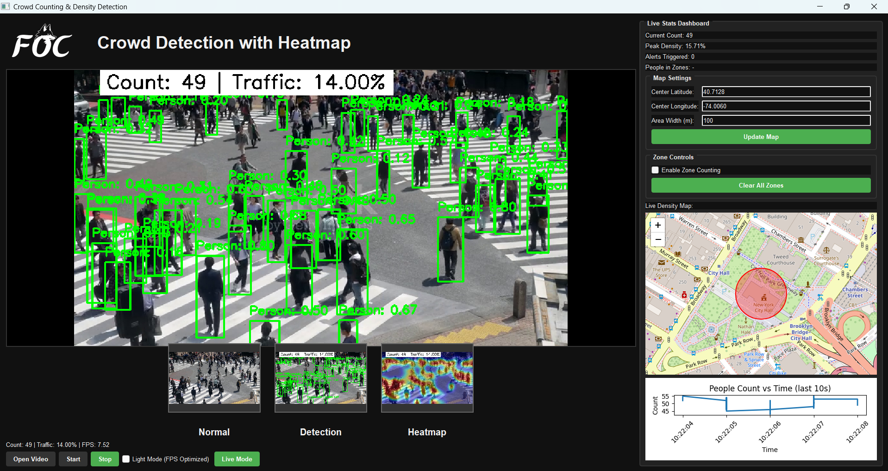

Crowd Counting & Density Detection with Heatmap Visualization

A modern PyQt5 desktop application for real-time crowd counting, density estimation, and heatmap visualization using YOLOv8 and OpenCV. Supports video files, live webcam, and RTSP streams. Includes interactive zone-based counting and a live minimap overlay.

---

## Features

- **Real-time Crowd Counting** using YOLOv8 object detection
- **Density Heatmap Visualization** over video
- **Zone-based Counting**: Draw custom zones and get people counts per zone
- **Overcrowding Alerts**: Configurable threshold for crowd density
- **Live Stats Dashboard**: Current count, peak density, alerts, and time-series chart
- **Interactive Minimap**: Shows coverage area on a map (Leaflet.js)
- **Supports Video Files, Webcam, and RTSP Streams**
- **Light Mode**: FPS-optimized mode for lower-end hardware
- **Modern, User-friendly PyQt5 GUI**

---

## Installation

1. **Clone the repository:**
   ```bash
   git clone https://github.com/AkashdeepG-FOC/Heat_Crowd.git
   cd Heat_Crowd
   ```

2. **Install dependencies:**
   ```bash
   pip install -r requirements.txt
   ```
   
   > **Note:** You may need to install additional system packages for PyQt5 and PyQtWebEngine, especially on Linux.

3. **Download YOLOv8 Weights:**
   - The default model file `yolov8n.pt` is expected in the project root. You can download it from the [Ultralytics YOLOv8 releases](https://github.com/ultralytics/ultralytics/releases) if not present.

---

## Usage

1. **Run the application:**
   ```bash
   python crowd_counting_gui.py
   ```

2. **Open a video file or start live mode:**
   - Click **Open Video** to select a video file (`.mp4`, `.avi`, etc.)
   - Or click **Live Mode** to use your webcam or an RTSP stream

3. **Zone-based Counting:**
   - Enable "Zone Counting" in the dashboard
   - Draw zones directly on the video by clicking and dragging
   - Selected zones will appear with a semi-transparent black overlay
   - Click "Clear All Zones" to remove all zones

4. **Map Settings:**
   - Adjust latitude, longitude, and area width to update the minimap
   - The minimap shows the coverage area corresponding to your video

5. **Controls:**
   - **Start/Stop**: Begin or end video analysis
   - **Light Mode**: Toggle for higher FPS (lower accuracy)
   - **Live Mode**: Use webcam or RTSP stream

6. **Dashboard:**
   - View live stats, alerts, and a time-series chart of people count

---

## Screenshot



---

## Requirements

- Python 3.7+
- PyQt5
- PyQtWebEngine
- opencv-python
- numpy
- ultralytics (YOLOv8)
- matplotlib

Install all dependencies with:
```bash
pip install -r requirements.txt
```

---


## Troubleshooting

- **No webcam detected:** Ensure your webcam is connected and not used by another application.
- **RTSP stream not working:** Double-check your RTSP URL and network connection.
- **PyQtWebEngine errors:** Try updating PyQt5 and PyQtWebEngine, or install missing system dependencies.
- **YOLOv8 errors:** Make sure `yolov8n.pt` is present in the project root.

---

## Credits

- [Ultralytics YOLOv8](https://github.com/ultralytics/ultralytics)
- [PyQt5](https://riverbankcomputing.com/software/pyqt/)
- [OpenCV](https://opencv.org/)
- [Leaflet.js](https://leafletjs.com/)

---

